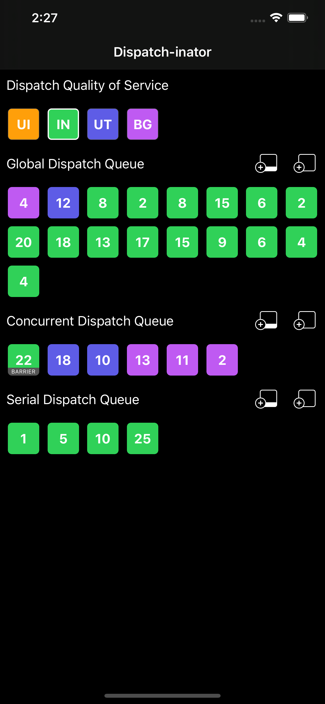

# dispatchinator
A simple app that shows visually how DispatchQueue operate especially with the barrier flag.

The UI was derived from the WWDC presentation <a href="https://developer.apple.com/videos/play/wwdc2017/706/">Modernizing Grand Central Dispatch Usage</a>.

  

